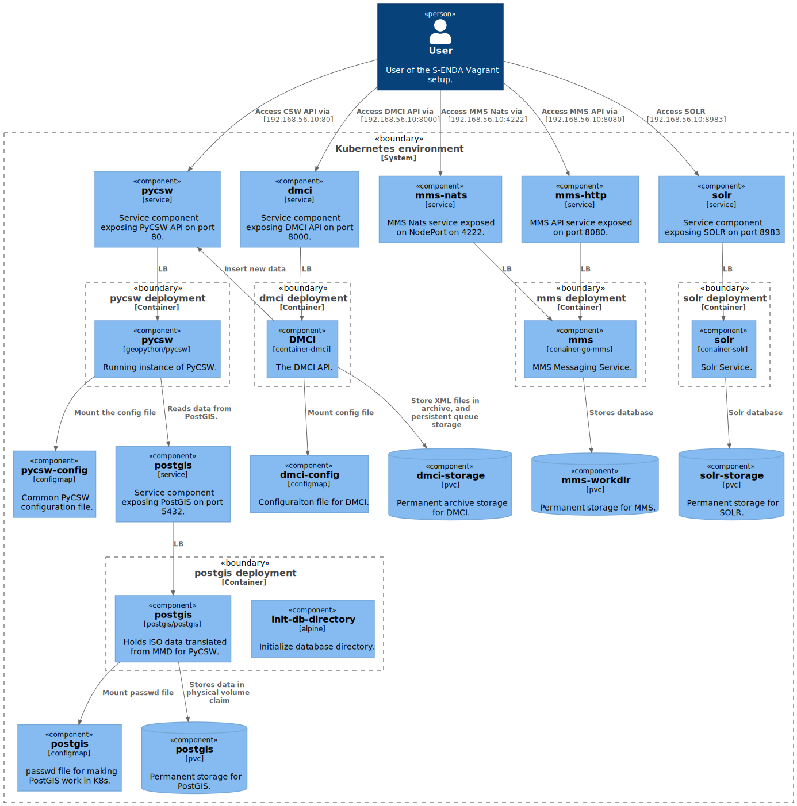

# vagrant-s-enda

Starts the S-ENDA specific software in a one node Kubernetes cluster based on [`k3s`](https://github.com/k3s-io/k3s).

This is meant for testing ingestion of metadata locally. More information about the S-ENDA project on the documentation pages [Welcome to S-ENDA’s documentation!](https://s-enda-documentation.readthedocs.io/en/latest/).

## Getting started

To start the S-ENDA services. Just start the VM as follows.

```bash
vagrant up
```

You have now started a VM with services that you can access from you local machine on the IP `10.10.10.10`. This is a private address and not accessible from  other machines.

### Endpoints

These are the endpoint you have access to.

* [`10.10.10.10`](http://10.10.10.10) --- PyCSW API endpoint
* [`10.10.10.10:8000`](http://10.10.10.10:8000) -- DMCI API endpoint
* [`10.10.10.10:8080`](http://10.10.10.10:8080) --- MMS API endpoint
* `10.10.10.10:4222` --- MMS NATS endpoint

### Inside the VM

All commands can be run from the `vagrant` user inside the VM. Access the VM by entering it with `vagrant ssh`.

* [`docker`](https://docs.docker.com/engine/reference/commandline/cli/) --- used as backend for `k3s`.
* [`kubectl`](https://github.com/kubernetes/kubectl) --- to interact with Kubernets.
* [`k9s`](https://github.com/derailed/k9s) --- for a terminal menu based interaction with Kubernetes.

#### Data storage

All permanent storage folders resides in the VMs `/opt` folder. Kubernetes assigns subfolder here dynamically which are mounted into the containers. In opt folder run the `tree` command to find the archive folder. Example output.

```plain
vagrant@k3s:/opt$ tree
.
├── containerd [error opening dir]
├── pvc-49dc1064-4e6b-4401-94b7-8e122e8524d1_default_postgis
│   └── postgres-data [error opening dir]
├── pvc-62205a5b-0b6d-4b21-be3c-be5c1f6a96fe_default_mms-workdir
│   ├── events.db
│   └── state.db
└── pvc-eda8301d-fc59-4d3d-b6b3-28d1ebf2b110_default_dmci-storage
    ├── archive       <------------ where MMD XML archive is stored
    └── workdir
```

## Usage examples

### Insert data

This validates the MMD file. If the validation goes through, we ingest the MMD file into the archive folder, convert it to ISO and ingest it PyCSW.

```bash
curl --data-binary @test/metopb-avhrr-20201201155244-20201201160030.xml http://10.10.10.10:8000/v1/insert
```

## Diagram

To connect the dots, we have a C4 diagram which describes how it all connects together.



<!---
'plantuml -tsvg README.md

@startuml dep
!includeurl https://raw.githubusercontent.com/plantuml-stdlib/C4-PlantUML/v2.0.1/C4_Component.puml

LAYOUT_TOP_DOWN()
'LAYOUT_LEFT_RIGHT
'LAYOUT_WITH_LEGEND()
'LAYOUT_AS_SKETCH()


'
' Persons
'
Person(internal_user, "User", "User of the S-ENDA Vagrant setup.")

'----------------------------------------------------------------------

System_Boundary(k8s_env, "Kubernetes environment") {

  '
  ' ConfigMap
  '
  Component(catalog_service_postgis_conf, "catalog-service-postgis", "configmap", "passwd file for making PostGIS work in K8s.")
  Component(pycsw_config, "pycsw-config", "configmap", "Common PyCSW configuration file.")
  Component(config_dmci, "dmci-config", "configmap", "Configuraiton file for DMCI.")

  '
  ' Services
  '
  Component(catalog_service_postgis_service, "catalog-service-postgis", "service", "Service component exposing PostGIS on port 5432.")
  Component(pycsw_service, "pycsw", "service", "Service component exposing PyCSW API on port 80.")
  Component("service_dmci", "dmci", "service", "Service component exposing DMCI API on port 8000.")
  Component("service_mms_nats", "mms-nats", "service", "MMS Nats service exposed on NodePort on 4222.")
  Component("service_mms_http", "mms-http", "service", "MMS API service exposed on port 8080.")


  '
  ' Deployment catalog-service-postgis
  '
  Container_Boundary("catalog_service_postgis_boundary", "catalog-service-postgis deployment") {
    Component(init_db_directory, "init-db-directory", "alpine", "Initialize database directory.")
    Component(catalog_service_postgis, "catalog-service-postgis", "postgis/postgis", "Holds ISO data translated from MMD for PyCSW.")
    Rel(catalog_service_postgis, catalog_service_postgis_conf, "Mount passwd file")
  }

  ComponentDb(catalog_service_postgis_storage, "catalog-service-postgis", "pvc", "Permanent storage for PostGIS.")
  ComponentDb(storage_dmci, "dmci-storage", "pvc", "Permanent archive storage for DMCI.")
  ComponentDb(storage_mms, "mms-workdir", "pvc", "Permanent storage for MMS.")

  Rel(catalog_service_postgis, catalog_service_postgis_storage, "Stores data in physical volume claim")

  '
  ' Deployment pycsw
  '
  Container_Boundary("pycsw_boundary", "pycsw deployment") {
    Component(pycsw1, "pycsw", "geopython/pycsw", "Running instance of PyCSW.")

    Rel(pycsw1, pycsw_config, "Mount the config file")
    Rel(pycsw_service, pycsw1, "LB")
  }

  Rel(pycsw1, catalog_service_postgis_service, "Reads data from PostGIS.")
  Rel(catalog_service_postgis_service, catalog_service_postgis, "LB")

  '
  ' Deployment dmci
  '
  Container_Boundary("boundary_dmci", "dmci deployment") {
    Component("container_dmci", "DMCI", "container-dmci", "The DMCI API.")

    Rel(service_dmci, "container_dmci", "LB")
    Rel(container_dmci, storage_dmci, "Store XML files in archive, and persistent queue storage")
    Rel_U(container_dmci, pycsw_service, "Insert new data")
    Rel(container_dmci, config_dmci, "Mount config file")
  }

  '
  ' Deployment dmci
  '
  Container_Boundary("boundary_mms", "mms deployment") {
    Component(container_go_mms, "mms", "conainer-go-mms", "MMS Messaging Service.")

    Rel(service_mms_nats, container_go_mms, "LB")
    Rel(service_mms_http, container_go_mms, "LB")
    Rel(container_go_mms, storage_mms, "Stores database")
  }


  '
  ' Deployment pycsw-ingest
  '

  Rel(internal_user, pycsw_service, "Access CSW API via", "10.10.10.10:80")
  Rel(internal_user, service_dmci, "Access DMCI API via", "10.10.10.10:8000")
  Rel(internal_user, service_mms_nats, "Access MMS Nats via", "10.10.10.10:4222")
  Rel(internal_user, service_mms_http, "Access MMS API via", "10.10.10.10:8080")

}

@enduml
-->


<!---
vim: set spell spelllang=en:
-->
